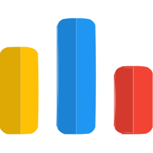

  

  <!-- Typing SVG -->
  

<!-- Social icons section -->

  
  &#8287;&#8287;&#8287;&#8287;&#8287;
  
  &#8287;&#8287;&#8287;&#8287;&#8287;
  
  &#8287;&#8287;&#8287;&#8287;&#8287;
  <!-- <a href="https://discordapp.com/users/740442954765959240" alt="Web" title="Personal Website"> -->
  
  <!-- </a> -->
  &#8287;&#8287;&#8287;&#8287;&#8287;
  
  &#8287;&#8287;&#8287;&#8287;&#8287;
  

 

<!-- Social badges section -->

  
  

 
  
<h2>📘 My Top Projects</h2>

  <!-- Small repo cards - https://github.com/DenverCoder1/github-readme-stats -->
  

    
    
    
    
    
    
  

  

 
  
<h2>📕 Top Projects I've Contributed To</h2>

  

  <!-- Example for future projects -->
    <!--  -->
  

  

    <!-- <a href="https://github.com/DenverCoderOne/My-Contributions/blob/main/README.md"> -->
    
  

 
  
<h2>🛠️ My Favorite Tools</h2>

  <!-- Badges are from https://github.com/Ileriayo/markdown-badges -->

  <h3>👨‍💻 Programming and Markup Languages</h3>

  

      
      
      
      
      
      
      
      
      
      
    

  <h3>🧰 Frameworks and Libraries</h3>

  

      
      
      
      
      
      
      
      
      
      
      
      
      
      
      
      
      
      
      
      
      
  

  <h3>🗄️ Databases and Cloud Hosting</h3>

  

      
      
      
  

  <h3>💻 Software and Tools</h3>

  

      
      
      
      
      
      
      
      
  

 
  
<h2>📊 Github Stats and Activity</h2>

  <h3>🔥 Streak Stats</h3>

  <!-- GitHub Readme Streak Stats - https://github.com/DenverCoder1/github-readme-streak-stats -->
  

    
    
🔥 Get streak stats for your profile at <a href="https://git.io/streak-stats">git.io/streak-stats</a>

  

  <h3>💻 GitHub Profile Stats</h3>

  <!-- https://github.com/anuraghazra/github-readme-stats -->

  
  
   

  <b>Note:</b> Top languages is only a metric of the languages my public code consists of and doesn't reflect experience or skill level.
  
  <!-- https://github.com/ashutosh00710/github-readme-activity-graph -->

  

  <h3>⚡ Recent GitHub Activity</h3>

  <!-- https://github.com/jamesgeorge007/github-activity-readme -->
  <!--START_SECTION:activity-->

1. 🎉 Merged PR [#843](https://github.com/DenverCoder1/custom-icon-badges/pull/843) in [DenverCoder1/custom-icon-badges](https://github.com/DenverCoder1/custom-icon-badges)
2. 🎉 Merged PR [#218](https://github.com/DenverCoder1/readme-typing-svg/pull/218) in [DenverCoder1/readme-typing-svg](https://github.com/DenverCoder1/readme-typing-svg)
3. 🎉 Merged PR [#217](https://github.com/DenverCoder1/readme-typing-svg/pull/217) in [DenverCoder1/readme-typing-svg](https://github.com/DenverCoder1/readme-typing-svg)
4. 🎉 Merged PR [#842](https://github.com/DenverCoder1/custom-icon-badges/pull/842) in [DenverCoder1/custom-icon-badges](https://github.com/DenverCoder1/custom-icon-badges)
5. 🎉 Merged PR [#840](https://github.com/DenverCoder1/custom-icon-badges/pull/840) in [DenverCoder1/custom-icon-badges](https://github.com/DenverCoder1/custom-icon-badges)
<!--END_SECTION:activity-->

